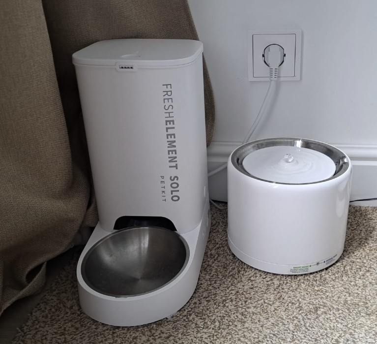
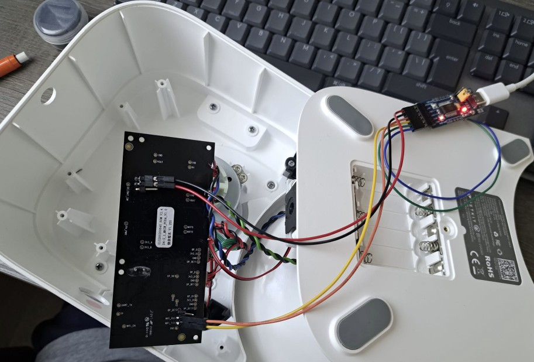
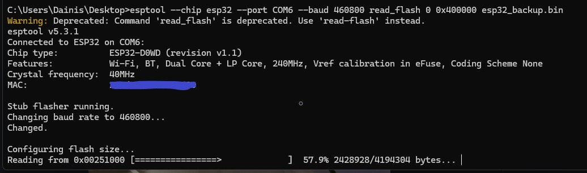

# 🐱 PetKit ESPHome — Fresh Element Solo + Eversweet 3 Pro

Free your PetKit devices from the cloud! Custom **ESPHome firmware** for the **PetKit Fresh Element Solo** pet feeder that also acts as a **BLE bridge** to the **PetKit Eversweet 3 Pro** water fountain — both devices fully local in **Home Assistant**, no PetKit servers, no app, no cloud. 🚫☁️

The feeder's own ESP32 is reflashed with ESPHome, and it talks to the fountain over Bluetooth Low Energy using the reverse-engineered PetKit W5 protocol.



---

## 🎯 Choose Your Build Path

This project offers **two options** depending on which devices you have:

### 🟢 Option 1: Feeder + Fountain Bridge (recommended)

**Best for**: Owners of both devices — one ESP32 controls everything

| Aspect          | Details                                                                 |
| --------------- | ----------------------------------------------------------------------- |
| **Difficulty**  | ⭐⭐ Moderate (opening the feeder + soldering-free serial flash)          |
| **Hardware**    | None to buy — uses the feeder's built-in ESP32-D0WD                     |
| **Config File** | `petkit-fresh-element-solo.yaml`                                        |
| **Result**      | Feeder + fountain as **one ESPHome device** in HA and one web UI        |

The fountain itself is **not modified at all** — the feeder connects to it over BLE in the background and relays everything.

### 🔵 Option 2: Fountain Only (standalone ESP32-C3)

**Best for**: Fountain-only owners, or if the feeder is out of BLE range of the fountain

| Aspect          | Details                                                                  |
| --------------- | ------------------------------------------------------------------------ |
| **Difficulty**  | ⭐ Easy (flash a dev board, nothing is opened)                            |
| **Hardware**    | Any ESP32-C3 dev board (~€3-5), e.g. ESP32-C3-DevKitM-1 / SuperMini      |
| **Config File** | `petkit-eversweet-3-pro.yaml`                                            |
| **Result**      | Fountain monitoring + control via a small BLE-to-WiFi bridge             |

> 💡 **Recommendation:** If you own both devices, go with **Option 1** — zero extra hardware and everything lives in a single device. Just make sure the feeder stands within BLE range of the fountain.

---

## ✨ Features

### Feeder (Fresh Element Solo)

- 🍽️ **Manual dispensing** — button in HA / web UI, physical button still works
- 📅 **Flexible feeding schedule** in one text field: `07:00=2, 12:30=1, 18:00=2` (any minute, not just full hours) with an **Apply/validate** button and live "next feeding" status
- 📉 **Low food detection** — compares pellets-per-scoop against a threshold, warns via sound + HA event
- 🧂 **Desiccant tracking** — 30-day replacement counter, warning sensor, HA event, one-tap reset
- 🕐 **Robust timekeeping** — NTP (Google + pool fallbacks) **and** Home Assistant as a secondary time source, runtime-selectable timezone, manual sync button, live clock display
- 🍴 **Last feeding sensor** — shows the most recent feeding as `2 serving(s) at 19:00`; its state is unique per feeding, making it a reliable Home Assistant trigger (no ESPHome event permission needed)
- 🔊 RTTTL melodies (mutable), status LED, dispensed-food statistics

### Fountain (Eversweet 3 Pro, via BLE)

- ⚡ **Power on / pause** and **Normal / Smart mode**
- 🚨 Warnings: **water missing**, **filter due**, **breakdown**
- 🧽 **Filter reset button** — sends the native BLE reset command (cmd 222), filter counter resets inside the fountain itself
- 📊 Filter usage %, pump runtime, voltage, serial, firmware version
- 🔄 Auto-reconnect + periodic polling (default 120 s)

### Web UI

ESPHome web server v3 with **sorting groups** — entities organized into *Feeding / Fountain / Settings / Diagnostics* sections.

---

## 📦 Repository Contents

| File                                   | Description                                             |
| -------------------------------------- | ------------------------------------------------------- |
| `petkit-fresh-element-solo.yaml`       | Option 1: feeder + fountain bridge (feeder's ESP32)     |
| `petkit-eversweet-3-pro.yaml`          | Option 2: fountain-only standalone reader (ESP32-C3)    |
| `secrets.yaml.example`                 | Template for your WiFi / API / OTA secrets              |
| `backup/esp32_stock_backup_SANITIZED.bin` | Stock PetKit firmware dump (personal data removed) — last-resort restore |
| `ha/automations.yaml`                  | Ready-made HA notification automations (copy & adapt)  |
| `img/`                                 | Photos / screenshots                                    |

---

## 🔧 Option 1: Flashing the Feeder

### What's inside



The Fresh Element Solo is built around an **ESP32-D0WD** (dual core, 4 MB flash) — perfect for ESPHome. Pinout and hardware photos are documented on the ESPHome devices page:
👉 **https://devices.esphome.io/devices/petkit-fresh-element-solo-pet-feeder/**

| GPIO   | Function                     |
| ------ | ---------------------------- |
| GPIO5  | Status LED                   |
| GPIO16 | Buzzer (RTTTL)               |
| GPIO34 | Manual feed button           |
| GPIO27 | Motor rotation sensor        |
| GPIO14 | Food (pellet) sensor         |
| GPIO33 | Sensor enable                |
| GPIO18/17/19 | Motor forward / reverse / enable |

### Step 0 — ⚠️ BACK UP THE STOCK FIRMWARE FIRST

Before flashing anything, dump the original 4 MB flash so you can always go back:

```powershell
esptool --chip esp32 --port COM6 --baud 460800 read-flash 0 0x400000 esp32_backup.bin
```



Connect a USB-serial adapter (3.3 V logic!) to the feeder board's serial pads: **GND, TX, RX** — and hold GPIO0 low on power-up to enter the bootloader.

> ⚡ **Power tip:** do **not** power the ESP32 from the USB-serial adapter's 3V3 pin — it cannot supply the WiFi+BLE current spikes and the board will brownout-loop. Power the board from the feeder's own PSU and connect only GND/TX/RX to the adapter. In my case, powering the ESP32 from the adapter's 3V3 pin was sufficient only for flashing the firmware. To test or run the firmware afterward, I powered the board from its regular power supply.

> ⚡ **Important: Do not power the board from both the feeder's power supply and the USB-to-serial adapter's 3V3 output at the same time. Powering the board from two different sources simultaneously can damage the ESP32 or the USB-to-serial adapter.

### Step 1 — Prepare secrets

Copy `secrets.yaml.example` to `secrets.yaml` in your ESPHome config folder and fill in your values.

### Step 2 — Set your fountain's MAC

In `petkit-fresh-element-solo.yaml`, set `fountain_mac` (substitutions at the top) to your fountain's BLE MAC. Find it with any BLE scanner app (nRF Connect) — the fountain advertises as a PetKit device.

### Step 3 — Flash

```bash
esphome run petkit-fresh-element-solo.yaml
```

First flash goes over serial; every update after that is OTA. 🎉

### Step 4 — Verify

- **Feeder time** shows the current time within seconds (NTP sync)
- **Fountain Online** turns on after ~10-15 s (BLE handshake: cmd 213 → 73 → 86)
- Press **Dispense food** — scoops turn, statistics update

---

## 🔧 Option 2: Standalone Fountain Reader

1. Get any **ESP32-C3** dev board
2. Set `fountain_mac` in `petkit-eversweet-3-pro.yaml`
3. `esphome run petkit-eversweet-3-pro.yaml`
4. Place the board within BLE range of the fountain

---

## 📡 PetKit BLE Protocol (short version)

Frame format used by W5-series fountains:

```
FA FC FD | cmd | type | seq | len | 00 | data... | FB
```

| Cmd | Purpose                              |
| --- | ------------------------------------ |
| 213 | Get device details (device ID, serial) |
| 73  | Init device (register secret)        |
| 86  | Sync                                 |
| 200 | Firmware version                     |
| 210 | Device state (power, mode, warnings, filter %, runtime) |
| 66  | Battery / voltage                    |
| 220 | Set power + mode                     |
| 222 | **Reset filter counter**             |

⚠️ **Important quirks:**

- The init command (73) re-registers the BLE secret → the **PetKit phone app loses control** of the fountain until you power-cycle the fountain.
- Only **one BLE central** can be connected to the fountain at a time.

---

## 💾 Stock Firmware Backup & Restore

`backup/esp32_stock_backup_SANITIZED.bin` is a full 4 MB dump of the original PetKit feeder firmware (hardware revision with ESP32-D0WD, serial prefix 2024). **Personal data has been erased** from it: the NVS, WiFi credentials, device serial, device ID/secrets, account binding, schedule and server-info partitions are blanked (`0xFF`).

To restore a feeder to stock:

```powershell
esptool --chip esp32 --port COM6 --baud 460800 write-flash 0 esp32_stock_backup_SANITIZED.bin
```

After restoring, set the feeder up again through the PetKit app (it will re-provision WiFi and re-register the device).

> ⚠️ **Disclaimer:** this image is provided as a **last resort** for the community. Always make **your own backup** before flashing — your dump contains your device's factory identity partitions, which this sanitized image does not. Restoring this image to a different hardware revision may not work. Use at your own risk.
>
> 🔒 If you publish your own dump: **sanitize it first.** A raw dump contains your WiFi password in plaintext, your device serial, and your PetKit account binding.

---

## 🏠 Home Assistant

The device appears automatically via the ESPHome integration. Useful events for automations:

| Event                          | Fired when                          |
| ------------------------------ | ----------------------------------- |
| `esphome.feeder_food_dispensed`| Food was dispensed (with scoop count) |
| `esphome.feeder_food_low`      | Hopper is running low               |
| `esphome.feeder_desiccant_due` | Desiccant is 30+ days old           |

### 📬 Ready-made notification automations

The repo ships with **[`ha/automations.yaml`](ha/automations.yaml)** — five Home Assitant automations. Copy the blocks into your `automations.yaml` (or paste into the UI editor in YAML mode), then adjust the **entity IDs** (HA may prefix them with your area name — check Developer Tools → States) and the **notify targets**.

1. 💧 **Water low** — fountain out of water (debounced, only when the BLE link is alive)
2. 🚰 **Filter due** — early warning at 95% used + the fountain's own alarm, with the live percentage in the message
3. 🧂 **Desiccant due** — 30-day reminder with reset instructions
4. 🍽️ **Food low** — hopper running low, includes the actual pellet count
5. 😻 **Food dispensed** — confirmation of every feeding, with humor scaled to portion size (triggered by the **Last feeding** sensor, whose timestamped state changes on every dispense)

---

## 🙏 Credits

This project stands on the shoulders of great community work:

- **[n6rdv / n6ham — ESPHome Fresh Element Solo config](https://devices.esphome.io/devices/petkit-fresh-element-solo-pet-feeder/)** — the original feeder GPIO mapping and base configuration this project extends
- **[RobertD502 — home-assistant-petkit](https://github.com/RobertD502/home-assistant-petkit)** — the definitive PetKit integration and protocol knowledge
- **[PetKit Custom Integration thread — Home Assistant Community](https://community.home-assistant.io/t/petkit-custom-integration/580286)** — discussion, testing and device insights
- **[phldgmn — ha-petkit-ble / PetkitW5BLEMQTT](https://github.com/phldgmn/ha-petkit-ble)** — reverse-engineered W5 BLE command set, including the filter reset (cmd 222)
- **[ESPHome](https://esphome.io)** — the platform that makes all of this possible

---

## 📄 License

Released into the **public domain** under [The Unlicense](https://unlicense.org) — no ownership, no restrictions. Do whatever makes your cats happy. 🐾

This project builds on the community work listed in the [Credits](#-credits) section above; those projects keep their own respective licenses.

## ⚠️ Disclaimer

Flashing custom firmware **voids your warranty** and carries a small risk of bricking the device. Feeding hardware keeps animals alive — always verify scheduled feedings work after every firmware change, and keep the physical manual-feed path tested. This project is not affiliated with PetKit.
